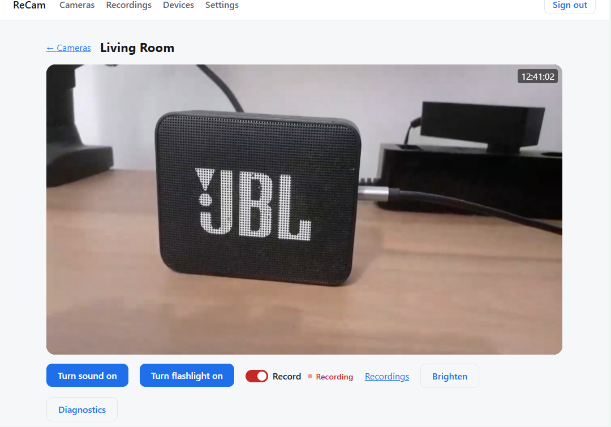
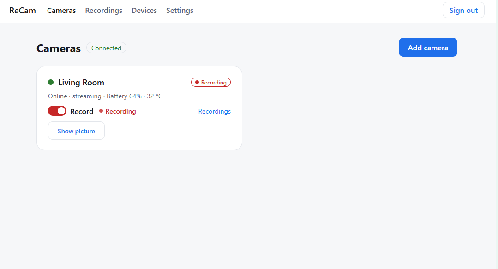
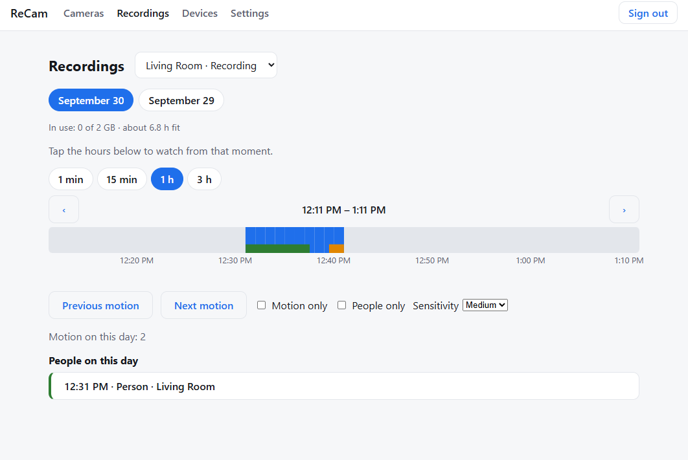
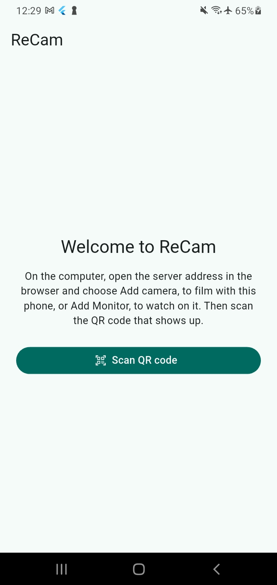
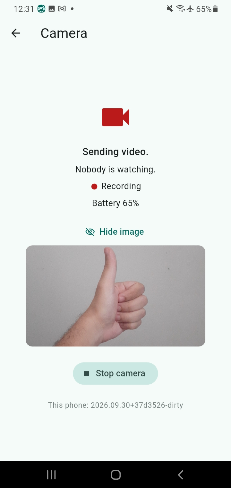

#  ReCam

[](https://github.com/jpemendonca/ReCam/actions/workflows/ci.yml)


ReCam turns spare Android phones into security cameras. You run the server on your own computer,
and you watch live and recorded video in the browser. Open source, no ads, no subscription.



You need:

- A computer that stays on, with Linux (Ubuntu, Debian or similar), or a VPS. Any computer from
  the last ten years works.
- An Android phone to film, with Android 9 or newer and the ReCam app.
- The computer and the phone on the same network, or a VPS both can reach.

## Screenshots

| Cameras | Recordings |
|---|---|
|  |  |

 

## Install

Open a terminal on the computer and run these, one at a time. Skip the first one if you already
have Docker and Git:

```bash
sudo apt update && sudo apt install -y docker.io docker-compose-v2 git
```

```bash
git clone https://github.com/jpemendonca/ReCam.git && cd ReCam/deploy
```

```bash
sudo bash ../scripts/build-server.sh && sudo docker compose up -d
```

The build takes a few minutes the first time. Check that the four lines say `Up`:

```bash
sudo docker compose ps
```

Then get the address and the first-time code:

```bash
sudo docker compose exec server ./Recam.Server code
```

Keep this output at hand. You need the address and the code in the next section:

```text
==================== ReCam ====================
No Monitor yet. On a computer:
  1. Open https://192.168.0.10:8443 in the browser and accept the certificate warning.
  2. Type the first-time code RHGJ-JCAU
===============================================
```

The code works once: the first browser that types it becomes your Monitor. If you lose it, run the
same command again.

On a VPS, add a line `RECAM_HOST=` with the VPS public IP to `.env` before you build, and open
ports 8443/tcp and 8189/udp in the provider's panel. With Docker Desktop on Windows or macOS, set
`RECAM_HOST` to the computer's network address and add `-f compose.bridge.yaml` to each
`docker compose` command.

## First use

1. On a computer or phone in the same network, open the address the last command showed, like
   `https://192.168.0.10:8443`. The browser warns that the connection is not private, because the
   server signs its own certificate. Choose **Advanced**, then **Proceed**.
2. Type the first-time code from the same output. This browser becomes your **Monitor** and shows an **Add camera** QR
   code.
3. On the phone that will film, open the ReCam app, tap **Scan QR code** and scan the code on the
   screen. Give the camera a name.
4. The live video opens in the browser, and the camera starts recording. Choose how much space the
   recordings may take; ReCam deletes the oldest when it fills up. You can switch the phone's
   flashlight from the live view.
5. When someone walks in front of the camera, the recordings page lists them under **People on
   this day** a minute or two later, and the player draws a box around each person.

To watch from another phone, install the app there and use **Add Monitor** in the browser. To
watch from another browser, use **Add Monitor › In a browser** and scan the QR code it shows.

To get the padlock without the warning, put a reverse proxy in front:
[docs/reverse-proxy.md](docs/reverse-proxy.md).

## If something goes wrong

- **`docker compose ps` shows `Restarting`, or a line is missing.** Read the log:

  ```bash
  sudo docker compose logs server
  ```

  "address already in use" means another program holds port 8443 or 8189. Stop that program and
  run `sudo docker compose up -d` again.

- **The browser cannot open the address.** Put the phone or the other computer on the same
  network as the server. If the server has a firewall on, open ReCam's two ports:

  ```bash
  sudo ufw allow 8443/tcp && sudo ufw allow 8189/udp
  ```

- **The code command shows several addresses, or one outside your network.** Add a line
  `RECAM_HOST=` with the computer's address in your network (like `RECAM_HOST=192.168.0.10`) to
  `.env`:

  ```bash
  nano .env
  ```

  Then start again:

  ```bash
  sudo docker compose up -d
  ```

- **The live video stays black or keeps loading.** The video travels on port 8189/udp, so open it
  in the firewall (above). The **Diagnostics** button under the video shows what your browser
  receives.

- **Nobody shows up under People on this day.** ReCam looks for people only in cameras that record,
  and only in the seconds with motion. Check the log:

  ```bash
  sudo docker compose logs detect
  ```

  "Looked for people in N segment(s)" means it works. A slow computer can fall a few minutes
  behind.

- **You lost the code.** Run the code command again. The code exists until the first Monitor.

- **You lost every Monitor.** This removes them and prints a new first-time code:

  ```bash
  sudo docker compose exec server ./Recam.Server reset-owner
  ```

- **You want to start over.** This deletes every pairing and every recording:

  ```bash
  sudo docker compose down -v && sudo docker compose up -d
  ```

## Update

In `ReCam/deploy`:

```bash
git pull && sudo bash ../scripts/build-server.sh && sudo docker compose up -d
```

Your pairings and recordings stay.

## Stop

```bash
sudo docker compose down
```

Your pairings and recordings stay until you start it again.

## The containers

- **`server`**: .NET 10 with a SQLite database. It serves the Monitor on port `8443`, pairs
  phones, relays the WebRTC signaling (WHIP/WHEP), sends commands like the flashlight and keeps
  recordings within their space. About 210 MB of RAM.
- **`mediamtx`**: receives video from the cameras on port `8189/udp`, sends it live to viewers and
  writes recordings in 1-minute files. About 50 MB of RAM.
- **`motion`**: FFmpeg with no network access. It scores motion in each finished recording for the
  timeline. About 60 MB of RAM and close to zero CPU at rest.
- **`detect`**: a small .NET program that looks for people. It reads the seconds `motion` marked,
  one frame per second, and runs the YOLOX-Tiny model on the CPU, with no network access. About
  150 MB of RAM, and up to one CPU core for a few seconds after each minute with motion.

## Development

You need the .NET 10 SDK, Flutter and Docker.

```bash
git config core.hooksPath .githooks
bash scripts/gate.sh
```

The gate checks formatting, analysis, build and tests for `server/` and `app/`. Server tests start
a MediaMTX container, so keep Docker running.

`bash scripts/build-server.sh` builds the Docker images and `bash scripts/build-apk.sh` builds the
APK, both stamped with the version from Git. Other builds show the version `dev`.

Architecture, protocol and decisions: [SPECS.md](SPECS.md). Code rules: [CODESTYLE.md](CODESTYLE.md).
Agent workflow: [AGENTS.md](AGENTS.md).

## License

[AGPL-3.0](LICENSE). Contributors sign a Contributor License Agreement.
